<div align="center">


**Can a neural network finish a famous quote?**
This project trains a `SimpleRNN` and an `LSTM` to predict the next word of a sentence, then compares how the two learn.

</div>

---

## ✨ Overview

Both models read a quote one prefix at a time and learn to guess the word that comes next. The two notebooks share the same preprocessing and hyper-parameters. Only the recurrent layer is swapped, so the comparison is fair.

| | |
|---|---|
| 📚 **Dataset** | 3,038 quotes, 1,005 unique authors (`dataset.csv`) |
| 🔤 **Vocabulary** | 8,723 unique words (tokenizer capped at 10,000) |
| 🧮 **Training samples** | 85,212 (prefix → next word) |
| 📏 **Longest sequence** | 745 tokens |
| 🏗️ **Framework** | TensorFlow / Keras |

---

## 📂 Repository Structure

```
.
├── dataset.csv        # 3,038 quotes + author
├── Rnn_model.ipynb    # full walkthrough: preprocessing, SimpleRNN + LSTM definitions, SimpleRNN training
├── LSTM.ipynb         # streamlined notebook: preprocessing + LSTM training
└── assets/            # animated SVGs used in this README
```

> **Heads-up:** both notebooks read `qoute_dataset.csv`. Rename `dataset.csv` to that (or edit the `pd.read_csv(...)` line) before running.

---

## 🔄 Data Pipeline


1. **Load**: read the `quote` column (the `Author` column isn't used for modelling).
2. **Clean**: lowercase, then strip punctuation with `str.replace(r'[^\w\s]', '', regex=True)`.
3. **Tokenize**: Keras `Tokenizer(num_words=10000)` maps words to integer IDs (`the`=1, `you`=2, `to`=3, …).
4. **Build samples**: every prefix of a quote becomes an input, and the next word is its label.
5. **Pad**: `pad_sequences(..., maxlen=745, padding='pre')` gives `X_pad` of shape `(85212, 745)`.
6. **Encode labels**: `to_categorical(y, num_classes=10000)` gives `y_one_hot` of shape `(85212, 10000)`.

### How one quote becomes many samples



---

## 🧠 Model Architectures



```python
emb_dim, rnn_units = 50, 128

# SimpleRNN
Sequential([
    Embedding(input_dim=10000, output_dim=emb_dim, input_length=max_len),
    SimpleRNN(units=rnn_units),
    Dense(10000, activation='softmax'),
])

# LSTM
Sequential([
    Embedding(input_dim=10000, output_dim=emb_dim, input_length=max_len),
    LSTM(units=rnn_units),
    Dense(10000, activation='softmax'),
])
```

**Compile and train (identical for both):**

```python
model.compile(optimizer='adam', loss='categorical_crossentropy', metrics=['accuracy'])
model.fit(X_pad, y_one_hot, epochs=100, batch_size=128)
```

---

## 📈 Results



| Metric (epoch 100) | SimpleRNN | LSTM |
|---|:---:|:---:|
| Training accuracy | **76.94%** | 72.41% |
| Training loss | **0.9703** | 1.2455 |
| Accuracy @ epoch 25 | **54.5%** | 33.6% |
| Accuracy @ epoch 50 | **69.5%** | 53.2% |
| Approx. time per epoch (Colab GPU) | ~42 s | ~35 s |

**Takeaways**

- Both models start near 4% accuracy and climb steadily for the full 100 epochs.
- The **SimpleRNN converged faster** here. The LSTM is still improving at epoch 100, so more epochs might close the gap.
- The LSTM has ~4× more recurrent parameters (91,648 vs 22,912), which likely contributes to its slower start.

> ⚠️ **Read these numbers with care.** They are *training* metrics only. There is no validation or test split, so high accuracy partly reflects the model memorising quote fragments. Adding a hold-out set (and perplexity) is the most important next step.

---

## 🚀 Getting Started

```bash
pip install tensorflow pandas numpy matplotlib seaborn
jupyter notebook Rnn_model.ipynb
```

Or open the notebooks in Google Colab.

> **Memory note:** `y_one_hot` is 85,212 × 10,000 floats (about 3.4 GB in float32). Use a GPU/high-RAM runtime, or switch to `sparse_categorical_crossentropy` with integer labels to avoid the one-hot matrix.

### 🔮 Try it: predict the next word

*This snippet isn't in the notebooks. It's a starting point for using the trained model.*

```python
def predict_next(model, tokenizer, text, max_len=745):
    seq = tokenizer.texts_to_sequences([text.lower()])[0]
    seq = pad_sequences([seq], maxlen=max_len, padding='pre')
    idx = model.predict(seq, verbose=0).argmax(axis=-1)[0]
    return tokenizer.index_word.get(idx, '?')

def generate(model, tokenizer, seed, n_words=10):
    for _ in range(n_words):
        seed += " " + predict_next(model, tokenizer, seed)
    return seed

print(generate(rnn_model, tokenizer, "the world as we have"))
```

`Rnn_model.ipynb` also saves the trained SimpleRNN with `rnn_model.save("Rnn_model.h5")`.

---

## 🛣️ Ideas for Improvement

- [ ] Add a train/validation split, early stopping, and perplexity tracking
- [ ] Use `sparse_categorical_crossentropy` to cut memory use
- [ ] Cap sequence length (one outlier quote sets `max_len` to 745; the median quote is ~18 words)
- [ ] Try stacked / bidirectional LSTM or GRU layers with dropout
- [ ] Save the tokenizer (`pickle`) alongside the model, and save the LSTM model too
- [ ] Add sampling with temperature for more varied text generation
- [ ] Build a small Streamlit / Gradio demo

---

<div align="center">

Made with ❤️ using TensorFlow · If this helped, consider leaving a ⭐

</div>
